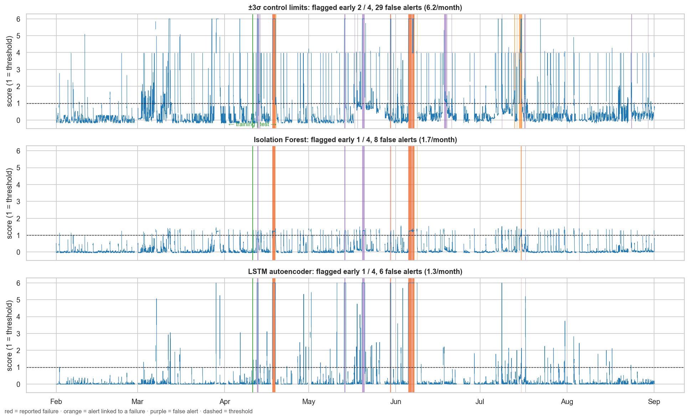
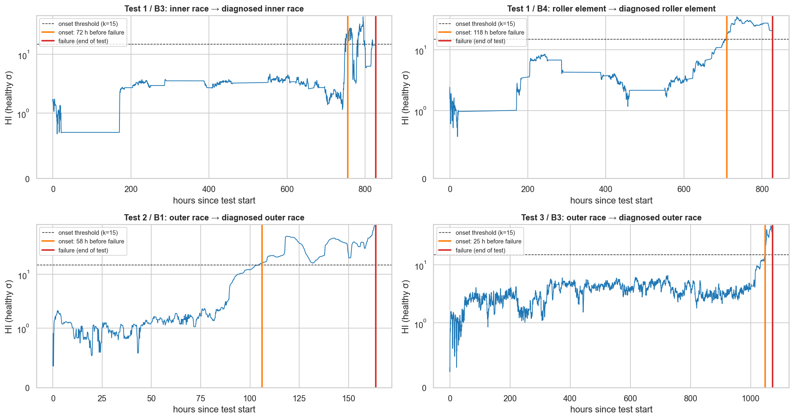
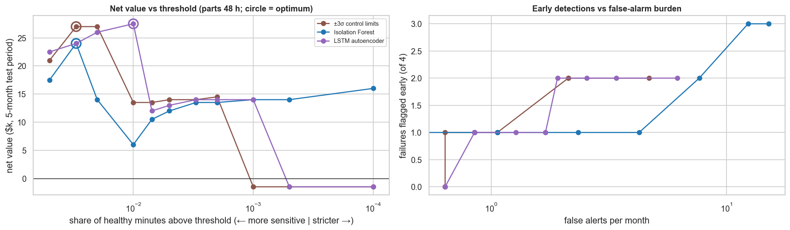

# CompressorGuard: Predictive Maintenance for Industrial Compressors

> Two complementary condition-monitoring modules: **(A)** anomaly detection on real operational telemetry from an air compressor (MetroPT-3), and **(B)** vibration-based degradation tracking on run-to-failure bearing tests (NASA IMS). Both feed one maintenance-economics model that sets alert thresholds by value, not accuracy.

   

---

## 1. The business problem

Compressors, and the bearings inside them, run the pneumatic systems, instrument air and conveying lines of cement, fertiliser, refining and manufacturing plants. An unplanned failure means downtime, emergency repair and lost production. It can also mean waiting days for a spare part that nobody ordered in time.

Plants usually either run equipment to failure or service it on a fixed calendar. This project tests a third option:

> **Can we detect degradation early enough to plan the repair *and* get the part in, without flooding engineers with false alarms?**

It attacks the problem from two angles, matching how real plants instrument rotating equipment:

| Module | Signal type | What it answers |
|---|---|---|
| **A. Operational telemetry** | Low-frequency process signals (pressure, temperature, motor current, valve states) | *Is the machine behaving abnormally?* |
| **B. Vibration condition monitoring** | High-frequency accelerometer data (20.48 kHz) | *Is a bearing degrading, what kind of fault is it, and how long is left?* |

## 2. Datasets

### Module A: MetroPT-3 (real operational data)

**[MetroPT-3, UCI Machine Learning Repository](https://archive.ics.uci.edu/dataset/791/metropt+3+dataset)** contains readings from the air production unit of a metro train compressor in Porto, Portugal.

| Property | Detail |
|---|---|
| Period | 1 February – 1 September 2020 |
| Size | 1,516,948 rows, one reading about every 10 s, ~208 MB CSV |
| Analog signals (7) | `TP2`, `TP3`, `H1`, `DV_pressure`, `Reservoirs`, `Oil_temperature`, `Motor_current` |
| Digital signals (8) | `COMP`, `DV_eletric`, `Towers`, `MPG`, `LPS`, `Pressure_switch`, `Oil_level`, `Caudal_impulses` |
| Failures | 4 air leaks from the operator's failure report (Apr, May, Jun, Jul 2020), with maintenance times, in `config/failures.yaml` |
| Licence | CC BY 4.0 |

Three data facts, found in the audit, shape everything downstream:
1. **`COMP` is inverted.** It is the air-intake valve signal and is active when there is *no* intake. The compressor is loaded when `COMP == 0`, as confirmed by motor current (5.6 A vs 1.4 A), `TP2` and the outlet valve. Healthy loaded duty is ~10–20 %, rising to ~100 % during a leak.
2. **~7 days of frozen-logger data.** In 10,222 minutes, every analog sensor is stuck at a constant value, including the 15 h right before F1. These minutes are masked from training and scoring.
3. **Unreported leak-like episodes.** 12 Mar, 29 Mar, 12 Apr, 13 May and 19–20 May show 10–20 h of continuous loading with collapsing pressure and hot oil, yet none of them is in the failure report.

### Module B: NASA IMS Bearing Dataset (run-to-failure vibration)

**IMS Bearing Dataset**, from the Center for Intelligent Maintenance Systems at the University of Cincinnati, distributed via the [NASA Prognostics Data Repository](https://www.nasa.gov/intelligent-systems-division/discovery-and-systems-health/pcoe/pcoe-data-set-repository/).

| Property | Detail |
|---|---|
| Rig | 4 Rexnord ZA-2115 bearings on one shaft, 2,000 RPM, 6,000 lb radial load, run until failure |
| Sampling | 20,480 points per 1 s snapshot, recorded about every 10 min. The readme says "20 kHz", but the outer-race envelope peak matches the geometric BPFO only at **20,480 Hz** (0.2 % vs 2.5 % error; notebook 04) |
| Test 1 | 8 channels (2 per bearing), 2,156 files, 828 h. Failures: **bearing 3 inner race**, **bearing 4 roller element**. Stopped for 148 h at hour 170 |
| Test 2 | 4 channels, 984 files, 164 h. Failure: **bearing 1 outer race** |
| Test 3 | 4 channels, 6,324 files (the readme says 4,448), 1,073 h. Failure: **bearing 3 outer race** |

See [`DATA.md`](DATA.md) for download steps and folder layout.

**Why unsupervised first:** real plants rarely have many labelled failures. Models that learn "healthy" and flag deviation are closer to how this would be deployed on a new asset.

## 3. Approach

```
                ┌─ Module A: MetroPT-3 ─ causal features ─ CL / IF / LSTM-AE ─ alert logic ─ failure back-test ─┐
raw data ──────►│                                                                                                  ├──► maintenance economics ──► recommended threshold
                └─ Module B: IMS bearings ─ vibration features ─ health indicator ─ onset + diagnosis ─ RUL ───────┘
```

### Module A: operational anomaly detection
1. **Data audit** ([01](notebooks/01_metropt_audit.ipynb)). Sampling gaps, frozen-logger periods, sensor ranges, `COMP` semantics, and failure windows checked against the UCI report.
2. **Domain features** ([02](notebooks/02_metropt_features.ipynb), `features.py`), all computed on 1-minute buckets with **trailing windows only** (no centred windows, no back-fill):
   - Loaded **duty cycle** (15 min / 60 min / 6 h), **load starts per hour**, and **longest load run** in the last hour. A leak makes the compressor run longer, or never unload.
   - **Idle pressure-decay rate**: reservoir pressure lost per minute while unloaded, the most direct leak signature.
   - Motor current *while loaded*, current variability, ΔP (`TP2 − TP3`) while loaded, minimum reservoir pressure, low-pressure-switch share.
   - **Oil temperature relative to its own trailing 24 h level**, which removes the Feb→Jul seasonal drift.
   - Drift z-scores against the healthy window.
3. **Operating shifts.** Timestamps are bucketed into three 8-hour shifts, an **assumed** schedule (06–14, 14–22, 22–06) set in `config/params.yaml`. False-alert rates are reported per shift, normalised by exposure time.
4. **Models** ([03](notebooks/03_metropt_models.ipynb), `models.py`), all trained **only on healthy data** (1 Feb – 10 Apr, which ends 8 days before F1, minus the two unreported March episodes):
   - Baseline: ±3σ statistical control limits on 5 leak-physics features
   - Isolation Forest on 13 engineered features
   - LSTM autoencoder on 30-minute windows of 8 minute-level signals, where high reconstruction error means an anomaly
   - IF and LSTM thresholds are set to the 99.5th percentile of smoothed healthy scores. No failure labels are used.
5. **Alert logic.** A trailing 30-min median of the score. An alert fires only when the score stays above the threshold for 60 min with no data gap.
6. **Back-test.** An alert overlapping `[failure start − 72 h, logged maintenance]` belongs to that failure. Anything else is a false alert, counted over the out-of-sample period (11 Apr → 1 Sep). Splits are time-ordered only. Sensitivity to the 72 h rule and to persistence is reported.

### Module B: bearing vibration degradation
1. **Signal features** ([04](notebooks/04_ims_features.ipynb), `vibration/features.py`) per 1-second snapshot and bearing channel:
   - Time domain: RMS, peak, crest factor, **kurtosis**, skewness
   - Frequency domain: energy around the first three harmonics of BPFO / BPFI / 2×BSF (236.4 / 296.9 / 279.8 Hz, computed from bearing geometry), plus the **envelope spectrum** (2–8 kHz band-pass → Hilbert) at each defect frequency
2. **Health indicator** ([05](notebooks/05_ims_health_rul.ipynb), `vibration/health.py`). Log features are referenced to the **median of the other bearings on the same shaft** (common-mode rejection, which cancels the test 1 restart shift) and standardised to the bearing's first 24 h. HI = max one-sided z over RMS, kurtosis and the envelope bands, smoothed over 2 h.
3. **Onset detection.** An alarm fires when the HI stays above **k = 15σ** for 12 snapshots (~2 h). It counts as a detection only if raised within 1 week of failure; earlier alarms count as false. k was chosen from a stable plateau (k = 15–25) in a full sweep.
4. **Fault diagnosis.** The envelope band that has moved most after onset (BPFO → outer race, BPFI → inner race, 2×BSF → roller).
5. **Remaining useful life** (`vibration/rul.py`). An exponential fit on the RMS ratio after onset, extrapolated to a failure level learned **leave-one-bearing-out**. It is evaluated at 50/75/90 % of each bearing's onset→failure interval and compared with a naive baseline.

## 4. From alerts to decisions: maintenance economics

An alert is only worth something if it arrives early enough to act on it, which includes **getting the spare part**.

```
For each failure caught with lead time T:
    if T ≥ L_parts + L_schedule:   value = C_unplanned − C_planned
    else:                          value = C_unplanned − C_planned − C_expedite   (rush part / overtime)

Net value = Σ value(caught failures) − (false alerts × C_inspection)
```

| Parameter | Meaning | Illustrative value |
|---|---|---|
| `C_unplanned` | Cost of an unplanned failure (downtime × production value + emergency repair) | $25,000 |
| `C_planned` | Cost of a planned repair in a scheduled window | $4,000 |
| `C_expedite` | Extra cost of rushing a part or crew when the warning came late | $5,000 |
| `C_inspection` | Cost of investigating a false alert | $500 |
| `L_parts` | Spare-part lead time (hours) | 48 h |
| `L_schedule` | Time needed to schedule a maintenance window | 12 h |

[`06_maintenance_economics.ipynb`](notebooks/06_maintenance_economics.ipynb) (with `economics.py`) sweeps the alert threshold (Module A) and HI threshold (Module B) and shows:
- **Net value vs threshold**, marking the operating point that maximises value
- The **break-even false-alarm rate**: how many false alerts per month the programme can absorb and still pay off
- **Sensitivity to spare-part lead time**: how the optimal threshold shifts when parts take 1 day vs 2 weeks

All costs and lead times sit in `config/costs.yaml` as **illustrative assumptions**, meant to be replaced with a plant's actual figures.

### Streaming simulation (Module A)
Plant models score live data from historians, not CSV files. To show the pipeline works that way:
1. **Replay.** `stream/replay.py` sends MetroPT-3 rows in timestamp order at an accelerated rate (e.g. 1 simulated day per minute), mimicking a historian feed.
2. **Stateful features.** `stream/state.py` keeps the previous row, the current load-run start, and a 24 h buffer of minute buckets. It updates features incrementally as each row arrives, and skips frozen minutes by the same rule as batch.
3. **Online scoring and alerts.** Each closed minute is scored by the trained model, and the persistence rule fires alerts live. The Streamlit "Live replay" tab updates as the replay runs, and the FastAPI `/score/raw` endpoint uses the same state machine.
4. **Parity test.** `tests/test_stream_parity.py` checks that streamed **features, scores, smoothed scores and alert flags** match the batch pipeline, on synthetic data and on 1.5 days of real data before F4. The maximum difference is 0.0.

This is **simulated real-time on replayed data**, not a live plant connection. In production, `replay.py` would be replaced by a historian or MQTT/OPC-UA subscriber, and the rest stays the same.

## 5. Results

All numbers come from the notebooks and are reproducible with the commands in §9.

**Module A: MetroPT-3 back-test (4 documented failures; test period 11 Apr – 1 Sep 2020, default thresholds)**

| Model | Failures flagged early | Detected by end of failure | Median lead time (hrs) | False alerts / month | Net value (illustrative) |
|---|---|---|---|---|---|
| ±3σ control limits | 2 / 4 (F3, F4) | 4 / 4 | 52.3 | 6.2 | $17,500 |
| Isolation Forest | 1 / 4 (F4) | 4 / 4 | 35.2 | 1.7 | $12,000 |
| LSTM autoencoder | 1 / 4 (F3) | 4 / 4 | 46.6 | **1.3** | $13,000 |

Late detections come 1.0–3.8 h after the reported onset. At the **value-optimal threshold** (notebook 06: healthy quantile 0.97–0.99 instead of 0.995), net value rises to $24–27.5k: the LSTM-AE and control limits flag 2/4 early at ~2 false alerts/month, and the IF flags 3/4 at ~12/month.



**Module B: IMS bearing degradation (k = 15σ, alarm persistence ~2 h)**

| Test / bearing | Known failure | Onset detected (hrs before failure) | Dominant fault band | RUL error @ 75 % of degradation period |
|---|---|---|---|---|
| Test 1 / B3 | Inner race | 72 (at 91 % of life) | BPFI → inner race ✓ | +450 h (true RUL 18 h) |
| Test 1 / B4 | Roller element | 118 (86 %) | 2×BSF → roller ✓ | +1,429 h (true 29 h) |
| Test 2 / B1 | Outer race | 58 (65 %) | BPFO → outer race ✓ | +22 h (true 14 h) |
| Test 3 / B3 | Outer race | 25 (98 %) | BPFO → outer race ✓ | −6 h (true 6 h) |

4/4 failures were detected (median 65 h ahead) and 4/4 correctly diagnosed. There was 1 false alarm across the 8 surviving bearings.





**Key findings:**
- **Which MetroPT-3 signals moved first before failure.** The *idle pressure-decay rate* and *load starts per hour*. Before F4, idle decay ran at 1.7–2.5× its healthy 99th percentile and the compressor restarted ~7 times an hour for ~16 h before the reported onset. Duty cycle and oil temperature only jump *at* onset, which is why every model detects all four leaks within ~1–4 h but only F3/F4 have usable precursors. F1 cannot be predicted: the logger was frozen for the preceding 15 h.
- **"False" alerts are often real.** 3 of the Isolation Forest's 8 false alerts are the multi-hour continuous-load episodes on 12 Apr, 13 May and 20 May, which look like unreported leaks. The reported false-alarm rates are upper bounds.
- **Whether kurtosis or envelope energy gave the earliest bearing warning.** Envelope energy at the defect frequency, for the outer-race failures: test 2 B1's BPFO envelope jumped ~10× at hour 90, before RMS moved. For the inner-race and roller failures (test 1), kurtosis and RMS led. Envelope analysis also delivered 4/4 correct diagnoses.
- **Common-mode rejection mattered.** Without referencing the other bearings on the shaft, the test 1 restart looks like degradation in all four bearings at once.
- **RUL is not reliable with four bearings.** End-of-life RMS ratios range from 2.5× to 6.3×, so no shared failure level exists, and a naive "median remaining life" baseline beats the exponential model at every evaluation point. Onset and diagnosis are the dependable Module B outputs. RUL stays future work that needs more run-to-failure histories.
- **Recommended thresholds, and how parts lead time changes them.** Set the Module A alert threshold *more sensitive* than the statistical default (healthy 97th–99th percentile), and the bearing onset at k ≈ 15σ. Longer parts lead times do **not** move the optimal threshold here, because no precursor gives more than ~2.5 days of warning. With 1–2-week parts, every catch falls to the "expedited" value, and long-lead spares should be **stocked** rather than predicted. At the optimum, the programme could absorb ~14–22 false alerts/month before it stops paying.

## 6. Limitations

- **MetroPT-3:** only 4 failures, all air leaks, so lead-time estimates are indicative, not statistically robust. Value-optimal thresholds are chosen in-sample. The shift schedule is assumed, not recorded in the data. Unreported leak-like episodes make the "healthy" label noisy in both directions. F1 and F2 run-ups are partly lost to frozen or missing data.
- **IMS:** a controlled lab test at constant speed and load. Real plant bearings run under varying conditions. The onset threshold was chosen on the same 4 failed bearings it is evaluated on (8 surviving bearings act as controls), and RUL estimates are illustrative only.
- **Bridging the two:** the datasets come from different machines. In a real deployment, telemetry and vibration would come from the same asset and be fused.
- Cost figures are illustrative. The streaming demo replays historical data; it's not connected to a live feed.

## 7. How this would deploy in a plant

```
Process sensors / PLC ─► Historian (e.g. OSIsoft PI) ─┐
                                                       ├─► feature jobs ─► model API ─► alert ─► CMMS work order + parts check
Vibration sensors ─► edge FFT / condition monitor ────┘                        │
                                                                 monitoring: drift, alert rate, model health
```

## 8. Repository structure

```
compressor-guard/
├── config/
│   ├── params.yaml             # windows, features, shifts, model, alert, back-test and IMS settings
│   ├── failures.yaml           # MetroPT-3 failure windows + maintenance times (UCI report)
│   └── costs.yaml              # illustrative costs + lead times
├── data/                       # not committed (see DATA.md)
├── notebooks/
│   ├── 01_metropt_audit.ipynb         # gaps, frozen logger, COMP semantics, failure verification
│   ├── 02_metropt_features.ipynb      # causal features, unreported episodes, precursors
│   ├── 03_metropt_models.ipynb        # control limits, Isolation Forest, LSTM-AE, back-test
│   ├── 04_ims_features.ipynb          # sampling-rate check, time/frequency/envelope features
│   ├── 05_ims_health_rul.ipynb        # health indicator, onset, diagnosis, RUL
│   └── 06_maintenance_economics.ipynb
├── src/compressor_guard/
│   ├── config.py               # project paths + YAML loading
│   ├── data.py                 # MetroPT-3 loading, audits, labels
│   ├── features.py             # MetroPT-3 features + shifts (CLI)
│   ├── models.py               # detectors, training, MLflow (CLI)
│   ├── alerts.py               # smoothing + persistence
│   ├── backtest.py             # lead time, false alerts, threshold sweeps (CLI)
│   ├── economics.py            # shared cost model
│   ├── api.py                  # FastAPI scoring endpoint
│   ├── stream/
│   │   ├── replay.py           # timestamp-ordered accelerated replay (CLI)
│   │   └── state.py            # rolling buffer + incremental features + online alerts
│   └── vibration/
│       ├── io.py               # IMS file discovery + loading
│       ├── features.py         # RMS, kurtosis, FFT bands, envelope (CLI)
│       ├── health.py           # health indicator, onset, diagnosis (CLI)
│       └── rul.py              # exponential RUL, leave-one-bearing-out
├── scripts/download_data.py
├── app/dashboard.py            # Streamlit: Module A alerts, Module B health curves, live replay
├── tests/                      # 24 tests incl. test_stream_parity.py
├── reports/                    # result CSVs + figures used in this README
├── DATA.md
├── requirements.txt
└── README.md
```

## 9. Getting started

```bash
git clone https://github.com/DareAdekunle/compressor-guard.git
cd compressor-guard
python -m venv .venv && source .venv/bin/activate      # or: conda activate <env> (Python 3.11)
pip install -r requirements.txt                         # also installs the package itself (-e .)

python scripts/download_data.py            # see DATA.md (needs a Kaggle API token for IMS)

# Module A (~3 min)
python -m compressor_guard.features --config config/params.yaml
python -m compressor_guard.models --train --config config/params.yaml
python -m compressor_guard.backtest --config config/params.yaml

# Module B (~2 min on 8 cores)
python -m compressor_guard.vibration.features --test 1 2 3
python -m compressor_guard.vibration.health --test 1 2 3

pytest                                      # 24 tests; data-dependent ones skip if data is missing

mlflow ui --backend-store-uri sqlite:///mlflow.db
uvicorn compressor_guard.api:app --reload   # http://127.0.0.1:8000/docs
streamlit run app/dashboard.py

# Streaming simulation (Module A)
python -m compressor_guard.stream.replay --speed 1440   # 1 simulated day per minute
```

The notebooks can also be run top to bottom in order (01 → 06). Each one reads the previous one's outputs from `data/processed/` and `models/`, and saves the figures in `reports/figures/`. To run them all headless:

```bash
for nb in notebooks/0*.ipynb; do jupyter nbconvert --to notebook --execute --inplace "$nb"; done
```

## 10. Tech stack

Python · pandas · NumPy · SciPy (FFT, Hilbert envelope) · scikit-learn · PyTorch · MLflow · FastAPI · Streamlit · Plotly · pytest

## 11. Acknowledgements

- Veloso, B., Ribeiro, R.P., Gama, J., Pereira, P.M., *The MetroPT dataset for predictive maintenance*, Scientific Data (2022). Data: CC BY 4.0.
- Davari, N., Veloso, B., Ribeiro, R.P., Pereira, P.M., Gama, J., *Predictive maintenance based on anomaly detection using deep learning for air production unit in the railway industry*, IEEE DSAA (2021).
- Lee, J., Qiu, H., Yu, G., Lin, J., and Rexnord Technical Services, *Bearing Data Set*, IMS, University of Cincinnati, NASA Prognostics Data Repository (2007).
- Qiu, H., Lee, J., Lin, J., *Wavelet filter-based weak signature detection method and its application on rolling element bearing prognostics*, Journal of Sound and Vibration 289 (2006).

---

**Author:** Oludare Adekunle · [LinkedIn](https://www.linkedin.com/in/oludare-adekunle) · [GitHub](https://github.com/DareAdekunle)
_Portfolio project on public data._
